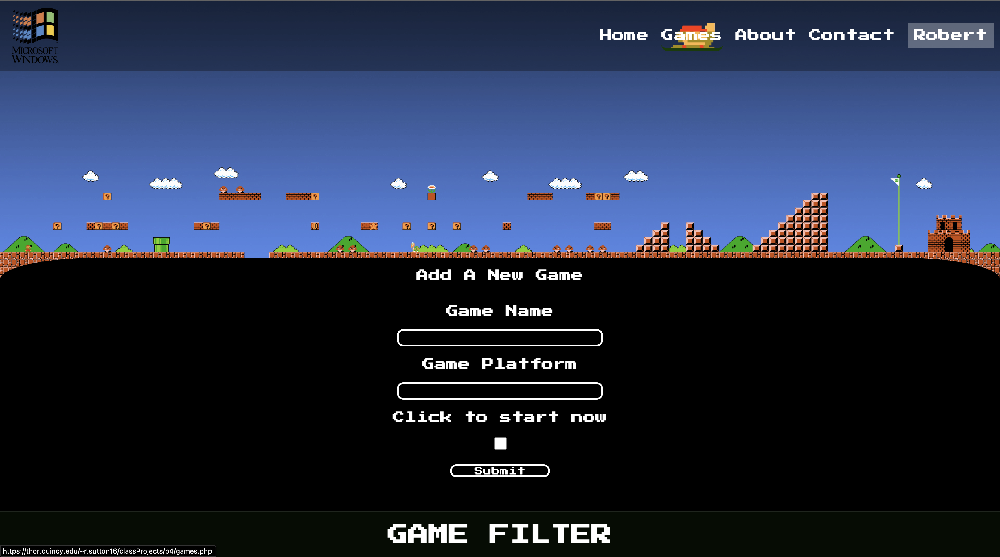
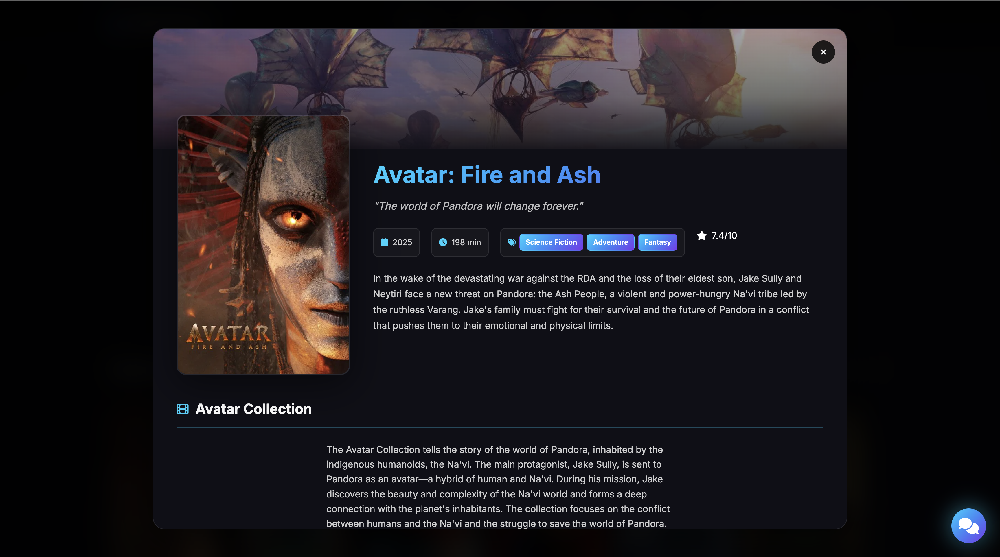
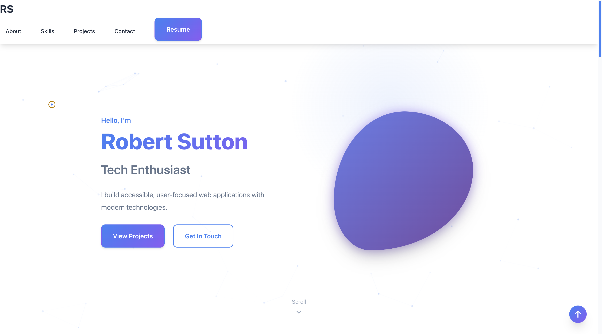
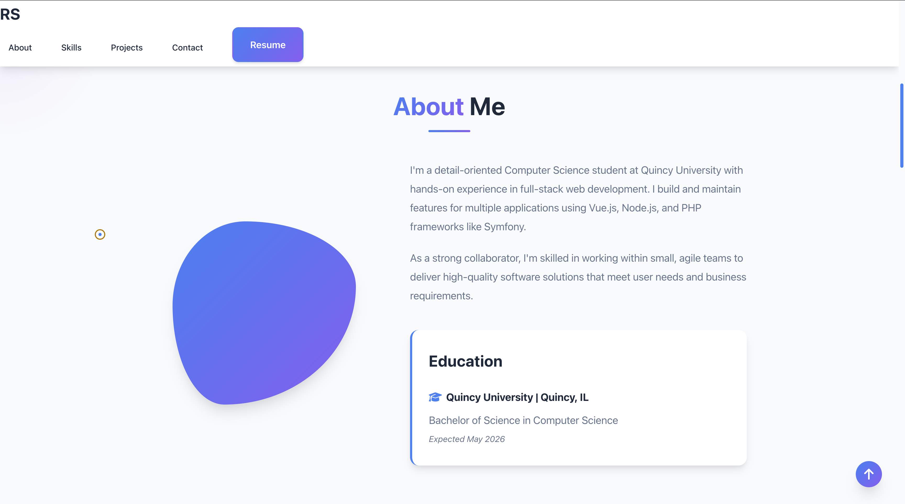

# Portfolio: Web Development and Creative Coding

This portfolio showcases my ability to build functional web applications.

---

### Featured Projects
* **MediaVerse**
* **GameBase**
* **Lemons**

---

### MediaVerse
A centralized guide for film and television metadata.

* **Link**: [View Project](https://thor.quincy.edu/~r.sutton16/mediaverse/)
* **Purpose**: Locates where specific movies or shows are streaming.
* **Data**: Displays titles, summaries, and high-quality posters.
* **Value**: Eliminates the need to check multiple streaming platforms manually.
* **Current State**: I have since made new versions, but with using AI, and I did not want to include work I have used AI with. But, if you are interested, I will have screenshots at the bottom with work I collaborated with AI. This version's chatbot and login is not functional at this time.

---

### GameBase
The final project for my Web Development class (P4). This is a full-stack application designed for game collection management.

* **Link**: [View Project](https://github.com/RsuttonWebsites/GameBase)
* **User Features**: Add games, update progress status (**Started/Completed**), and delete entries.
* **Stack**: HTML, CSS, JavaScript, PHP, and MySQL.

---

### Lemons
An all-in-one utility application designed to simplify daily tasks and calculations.

* **Link**: [View Project](https://your-link-here.com)
* **Tools**: Features dedicated modules for cooking, measuring, and time-keeping.
* **Functionality**: Provides rapid unit conversions and household calculators.
* **Value**: Consolidates essential daily tools into a single, lightweight interface.

---

### AI Collab Work
This section is not to show off my specific skills coding, but with collaboration with AI, which may or may not be needed for certain jobs in the future. This work I do not call fully mine, but is heavily influenced by my vision (and I did write a lot of the code myself, just not all of it).

